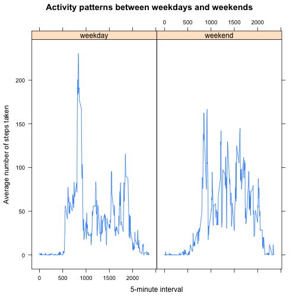

## Loading and preprocessing the data

- Loading the Data

```r
data <- read.csv("activity.csv", header = T )
```

- Preprocessing the data

```r
dataclean <- data[which(data$steps!= "NA"), ]
## correct the date formate
dataclean$date <- as.Date(dataclean$date, "%Y-%m-%d")
```

## What is mean total number of steps taken per day?

- Histogram of the total number of steps taken each day

```r
## spliting the data by steps and dates, caculate the sum of steps
splitStepbyDate <-split(dataclean$steps, dataclean$date)
StepSum <- as.data.frame(sapply(splitStepbyDate, sum))
names(StepSum) <- c("steps")
## making the graph
hist(StepSum$steps, breaks = nrow(StepSum),
     main =" Total number of steps taken per day",
     xlab ="dates", ylab = "steps")
```

 

- The *mean* and *median* total number of steps taken per day


```r
mean(StepSum$steps)
```

```
## [1] 10766.19
```

```r
median(StepSum$steps)
```

```
## [1] 10765
```

## What is the average daily activity pattern?
- Make a time series plot of the 5-minute interval and the average number of steps taken, averaged across all days

```r
library(plyr)
databyStepAvg <- ddply(dataclean, .(interval), summarize, steps = mean(steps))
plot(databyStepAvg$interval, databyStepAvg$steps, type = "l",xlab = "5-interval", ylab = "Avg Steps")
```

 

- Which 5-minute interval, on average across all the days in the dataset, contains the maximum number of steps?

```r
databyStepAvg$interval[which.max(databyStepAvg$steps)]
```

```
## [1] 835
```

## Imputing missing values
- Calculate and report the total number of missing values in the dataset

```r
sum(is.na(data))
```

```
## [1] 2304
```

- Devise a strategy for filling in all of the missing values in the dataset. The strategy does not need to be sophisticated. For example, you could use the mean/median for that day, or the mean for that 5-minute interval, etc.

    I will use the mean for that 5-minute interval.

- Create a new dataset that is equal to the original dataset but with the missing data filled in.

```r
## changing colnames from steps to intervalMean
colnames(databyStepAvg) [2] <- "intervalMean" 
library(plyr)
## Merge the data by using interval as indicator
combined <- arrange(join(data, databyStepAvg),interval)
```

```
## Joining by: interval
```

```r
## Replacing the NA value by the mean of 5-minute interval
combined$steps[is.na(combined$steps)] <- combined$intervalMean[is.na(combined$steps)]
```

- Make a histogram of the total number of steps taken each day and Calculate and report the mean and median total number of steps taken per day. Do these values differ from the estimates from the first part of the assignment? What is the impact of imputing missing data on the estimates of the total daily number of steps?
1. Histogram graph

```r
Newcombined <- ddply(combined,.(date),summarise, steps = sum(steps))
hist(Newcombined$steps, 
     breaks = nrow(Newcombined), 
     main = "Total number of steps taken each day", 
     xlab = "dates", ylab = "steps")
```

 

2. Mean and Meddian

```r
mean(Newcombined$steps)
```

```
## [1] 10766.19
```

```r
median(Newcombined$steps)
```

```
## [1] 10766.19
```

3. There is no signaficate impact of imputting missing data. 
   The mean value stays the same and median value changes less than 0.01%.

## Are there differences in activity patterns between weekdays and weekends?
- Create a new factor variable in the dataset with two levels – “weekday” and “weekend” indicating whether a given date is a weekday or weekend day.

```r
## setting weekdays type to current date data
weekdays <- weekdays(as.Date(combined$date))
## adding new column day
CombinedwithDays <- transform(combined, day = weekdays)
## adding new colum type 
CombinedwithDays$type <- ifelse(CombinedwithDays$day %in% c("Saturday", "Sunday"), "weekend", "weekday")
## new dataframe with mean of steps
NewCombinedwithDays <- ddply(CombinedwithDays, .(interval, type), summarise, steps = mean(steps))
```

- Make a panel plot containing a time series plot of the 5-minute interval (x-axis) and the average number of steps taken, averaged across all weekday days or weekend days (y-axis). 

```r
library(lattice)
par(mfrow = c(1,2))
xyplot(steps ~ interval| type, data = NewCombinedwithDays, 
       type = "l", 
       main = "Activity patterns between weekdays and weekends", 
       xlab = "5-minute interval", ylab = "Average number of steps taken")
```

 

